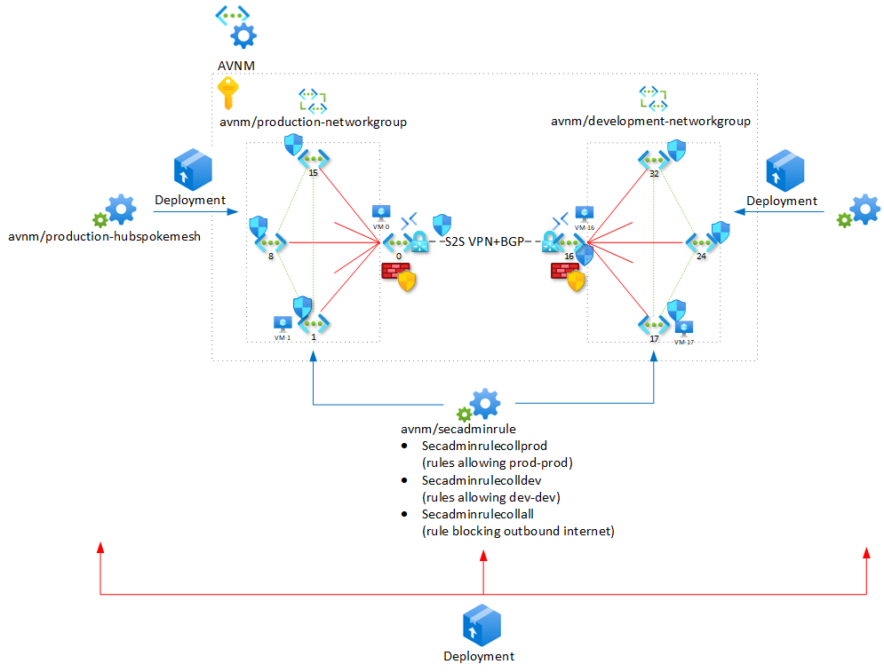

# AVNM Demo Lab

This is a lab to demonstrate and experiment with [Azure Virtual Network Manager](https://learn.microsoft.com/en-us/azure/virtual-network-manager/overview).

## Components
The lab consists of following elements:
- A set of VNETs:
  - Quantity is controlled by the `copies` parameter, (default: 20).
- Network Security Group:
  - Applied to the subnet `vmSubnet` in each VNET.
  - Contains an outbound rule denying traffic to private (RFC1918) ranges.
- Windows Server VMs:
  - In VNETs 0, 1, 2, and `copies`/2 (default: 10), `copies`/2+1 (11), `copies`/2+2 (12).
  - Each VM runs a basic webpage that returns the VM name.
- Bastion Hosts:
  - In VNETs 0 and `copies/2` (10).
- An AVNM instance `avnm`, scoped to the subscription.
- Network Groups:
  -  `production-networkgroup` contains VNETs 1 - `copies`/2-1 (9).
  -  `development-networkgroup` contains `copies`/2+1 (11) - `copies` (20).
- Network Configurations `production-hubspokemesh` and `development-hubspokemesh`, implementing a Hub&spoke with DirectConnectivity topology for the respective Network Groups.
- Security Configuration `secadminrule`,
  - Rule Collections `secadminrulecoll-production` and `secadminrulecoll-development`, each containing Allow rules, permitting communication within the respective Network Groups only (i.e. Production can only send traffic to Production, not to Development)
  - Rule Collection `no-internet` blocking outbound traffic from both Network Groups.
- VNET Gateways in VNETs 0 and `copies/2` (10) (the hubs of the Hub&spoke configurations for both Network Groups), with a VPN tunnel with BGP between them.



## Lab Deployment

Log in to Azure Cloud Shell at https://shell.azure.com/ and select Bash.

Ensure Azure CLI and extensions are up to date:
  
`az upgrade --yes`
  
If necessary select your target subscription:
  
`az account set --subscription <Name or ID of subscription>`
  
Clone the  GitHub repository:

`git clone https://github.com/mddazure/avnm-demo`

Change directory:

`cd ./avnm-demo`

Create a new resource group:

`az group create --name {rgname} --location {location}`

Deploy the bicep template:

`az deployment group create -g {rgname} --template-file templates/main-hub-s2s.bicep`

## AVNM Configuration Deployment
The Network- and Security Configurations need to be deployed to take effect. This may be achieved from the Network Manager page in the portal, under Settings -> Deployments -> Deploy configurations. 
Select Configurations to deploy and target region:


And Deploy:


## Explore

### VM Effective Routes

List the effective routes for the VM in Hub VNET 0:

`az network nic show-effective-route-table --name VMNic-0 -g {rgname} -o table`

```Source                 State    Address Prefix    Next Hop Type          Next Hop IP
---------------------  -------  ----------------  ---------------------  -------------
Default                Active   10.0.0.0/24       VnetLocal
Default                Active   10.0.1.0/24       VNetPeering
Default                Active   10.0.2.0/24       VNetPeering
Default                Active   10.0.3.0/24       VNetPeering
Default                Active   10.0.4.0/24       VNetPeering
Default                Active   10.0.5.0/24       VNetPeering
Default                Active   10.0.6.0/24       VNetPeering
Default                Active   10.0.7.0/24       VNetPeering
Default                Active   10.0.8.0/24       VNetPeering
Default                Active   10.0.9.0/24       VNetPeering
VirtualNetworkGateway  Active   10.0.11.0/24      VirtualNetworkGateway  20.13.72.192
VirtualNetworkGateway  Active   10.0.10.158/32    VirtualNetworkGateway  20.13.72.192
VirtualNetworkGateway  Active   10.0.10.0/24      VirtualNetworkGateway  20.13.72.192
VirtualNetworkGateway  Active   10.0.12.0/24      VirtualNetworkGateway  20.13.72.192
VirtualNetworkGateway  Active   10.0.13.0/24      VirtualNetworkGateway  20.13.72.192
VirtualNetworkGateway  Active   10.0.15.0/24      VirtualNetworkGateway  20.13.72.192
VirtualNetworkGateway  Active   10.0.14.0/24      VirtualNetworkGateway  20.13.72.192
VirtualNetworkGateway  Active   10.0.16.0/24      VirtualNetworkGateway  20.13.72.192
VirtualNetworkGateway  Active   10.0.17.0/24      VirtualNetworkGateway  20.13.72.192
VirtualNetworkGateway  Active   10.0.18.0/24      VirtualNetworkGateway  20.13.72.192
VirtualNetworkGateway  Active   10.0.19.0/24      VirtualNetworkGateway  20.13.72.192
Default                Active   0.0.0.0/0         Internet
```
Observe routes are present to all peered (spoke) VNETs, and to all VNETs in the other network groups via the VNET Gateway:

List the effective routes for the VM in Spoke VNET 1:

`az network nic show-effective-route-table --name VMNic-1 -g {rgname} -o table`

```
Source                 State    Address Prefix                                                                                   Next Hop Type          Next Hop IP
---------------------  -------  -----------------------------------------------------------------------------------------------  ---------------------  -------------
Default                Active   10.0.1.0/24                                                                                      VnetLocal
Default                Active   10.0.0.0/24                                                                                      VNetPeering
Default                Active   10.0.9.0/24 10.0.8.0/24 10.0.7.0/24 10.0.6.0/24 10.0.5.0/24 10.0.4.0/24 10.0.3.0/24 10.0.2.0/24  ConnectedGroup
VirtualNetworkGateway  Active   10.0.11.0/24                                                                                     VirtualNetworkGateway  20.13.72.192
VirtualNetworkGateway  Active   10.0.10.158/32                                                                                   VirtualNetworkGateway  20.13.72.192
VirtualNetworkGateway  Active   10.0.10.0/24                                                                                     VirtualNetworkGateway  20.13.72.192
VirtualNetworkGateway  Active   10.0.12.0/24                                                                                     VirtualNetworkGateway  20.13.72.192
VirtualNetworkGateway  Active   10.0.13.0/24                                                                                     VirtualNetworkGateway  20.13.72.192
VirtualNetworkGateway  Active   10.0.15.0/24                                                                                     VirtualNetworkGateway  20.13.72.192
VirtualNetworkGateway  Active   10.0.14.0/24                                                                                     VirtualNetworkGateway  20.13.72.192
VirtualNetworkGateway  Active   10.0.16.0/24                                                                                     VirtualNetworkGateway  20.13.72.192
VirtualNetworkGateway  Active   10.0.17.0/24                                                                                     VirtualNetworkGateway  20.13.72.192
VirtualNetworkGateway  Active   10.0.18.0/24                                                                                     VirtualNetworkGateway  20.13.72.192
VirtualNetworkGateway  Active   10.0.19.0/24                                                                                     VirtualNetworkGateway  20.13.72.192
Default                Active   0.0.0.0/0                                                                                        Internet

```
Observe single entry for all VNETs in the Network Group with Next Hop Type ConnectedGroup, and routes for all VNETs in the other Network Group via the VNET Gateway in the Hub.

### Effective Security Rules

Listing Effective security rules in the portal, on a VM NIC in one of the Network Groups, shows separate entries for the NSG attached to the subnet and the Admin Rules programmed by AVNM.

#### NSG Rules


#### Security Admin Rules


### Connectivity
Routes to other VMs exist, but outbound access is controlled by NSG- and the Security Admin Rules. 
- The Security Admin Rule collections contain Allow rules for each Network Groups' prefixes.
- Traffic permitted by Security Admin Rules with action Allow is subsequently evaluated by any NSGs attached to the subnet or NIC.
- The NSG attached to the subnet contains a rule blocking outbound communication to RFC1918 ranges.

#### From a Hub
Use Bastion Host in a Hub VNET to log in to the VM in that Hub.

Use `curl 10.0.{spoke number}.4` to check it is possible to connect to VMs in Spokes in the same Network Group, and in the other Group. Verify that there is internet access from the VM. 

It will not be possible to connect to any Spoke VM from a Hub. 

Reason: The Hubs are not controlled by AVNM as they are not part of any Network Group, so they do not have any Security Admin Rules applied. However, the normal NSG applied to the vmSubnet in all VNETs including Hubs has a rule blocking all outbound traffic to RFC1918 prefixes.

#### From a Spoke
Use Bastion Host in a Hub VNET to log in to the VM in a spoke connected to that Hub.

Use `curl 10.0.{spoke number}.4` to check whether is possible to connect to VMs in Spokes in the same Network Group, and in the other Group. Verify that there is no internet access from the VM. 

It will not be possible to any Spoke. 

Reason: The Spokes have both the Security Admin Rules and the NSG applied. The Security Admin Rules contain rules explicitly permitting outbound traffic to Spokes in the same Network Group. However, the Action on these rules is set to Allow - not Always Allow. This means that traffic permitted is still evaluated by the NSG, which blocks all outbound traffic to RFC1918 prefixec.

Now modify the Action to Always Allow and redeploy the configuration.

Check connectivity from Spoke to other Spokes again. It should now be possible to connect to Spokes in the same Network Group, as the Security Admin Rules allow outbound to the prefixes in the Group and are set to Always Allow.

### Monitoring and Logging

#### NSG Flows Logs

#### Network Watcher Diagnostics

## Live Demo Environment: Trusted / Non-trusted × Hub1 / Hub2 + Global Backup Mesh

> The deployed lab in subscription `<your-subscription-id>`, resource group `AVNM`
> (region `swedencentral`) has been re-configured from the original Production/Development
> Hub&Spoke-with-VPN pattern above into a **4 network group topology** — Trusted and Non-trusted,
> duplicated across two hubs (Hub1 and Hub2) — plus a cross-hub **global backup mesh** group,
> matching the "trusted/non-trusted, meshed or not, hub-per-region" reference design. See
> `whats-new.md` for the full change log. Architecture diagram:
> `avnm-architecture.png` / `avnm-architecture.excalidraw` (session artifacts).
>
> **Deployment status:** all three connectivity configs (`development-hubspokemesh`,
> `production-hubspokemesh`, `global-backup-mesh`) are committed and `Deployed` to `swedencentral`
> (verify with `az network manager list-deploy-status --network-manager-name AVNM-Demo -g AVNM --region swedencentral -o table`).
> Remember that mesh/`DirectlyConnected` connectivity never shows up as a VNet peering — always
> confirm it via effective routes (next hop type `ConnectedGroup`), not the Peerings blade.

Summary of the current live topology — **5 network groups**:

- **`trusted-hub1-networkgroup`** (`anm-vnet-2`, `8`, `9`, `10`): meshed via the
  `production-hubspokemesh` connectivity config (Hub&Spoke, `useHubGateway=true`) under hub
  `anm-vnet-0`/`hubfirewall-0`. Full any-to-any peering between the 4 VNETs in this group.
- **`nontrusted-hub1-networkgroup`** (`anm-vnet-1`, `3`–`7`, `11`–`15` — 11 VNETs): Hub&Spoke only
  (same `production-hubspokemesh` config, hub `anm-vnet-0`); spoke↔spoke traffic is routed through
  `hubfirewall-0`, no mesh.
- **`trusted-hub2-networkgroup`** (`anm-vnet-18`, `25`, `26`, `27`): meshed via
  `development-hubspokemesh` under hub `anm-vnet-16`/`hubfirewall-16`. Same pattern as Hub1's
  trusted group, in the second (logical) hub/region.
- **`nontrusted-hub2-networkgroup`** (`anm-vnet-17`, `19`–`24`, `28`–`31` — 11 VNETs): Hub&Spoke
  only, routed through `hubfirewall-16`, no mesh — mirrors Hub1's non-trusted group.
- **`global-backup-networkgroup`** (`anm-vnet-2` + `anm-vnet-18`, one trusted VNet from each hub):
  connected with a **Mesh** connectivity config (`global-backup-mesh`, global, direct peering, no
  hub) — a cross-hub / cross-region disaster-recovery backup link between the two trusted zones.

Each hub now has **its own Azure Firewall** (`hubfirewall-0` in Hub1, `hubfirewall-16` in Hub2),
acting as the router for its non-trusted spokes' transitive traffic — demonstrating the
firewall-as-hub-router pattern instead of a VPN shortcut between environments.

- **Simulated on-premises**: `anm-vnet-onprem` (10.100.0.0/24) with VPN Gateway `hubgw-onprem`,
  connected via site-to-site VPN (BGP) **only to Hub1** (`hubgw-0`, the production-origin hub).
  This is the only VPN connection in the lab — the old Hub2/Development gateway and the original
  Production↔Development VPN link were removed, since cross-environment traffic is now demonstrated
  with mesh + firewall routing instead of a VPN shortcut. Hub2 (`hubfirewall-16`) has no VPN
  Gateway.
- **Security Admin rules** (`secadminrule` config, 4 collections):
  - `secadminrulecollall` — deny-all-outbound baseline, applies to all 4 hub network groups.
  - `secadminrulecoll-production` — `allowwithinprod` (Allow) scoped to `nontrusted-hub1-networkgroup`.
  - `secadminrulecoll-development` — `allowwithindev` (Allow) scoped to `nontrusted-hub2-networkgroup`.
  - `secadminrulecoll-trusted` — `allowtrustedmesh-in`/`allowtrustedmesh-out` (**AlwaysAllow**),
    applied to **both** `trusted-hub1-networkgroup` and `trusted-hub2-networkgroup` — this is the
    rule collection that demonstrates Admin Rules (AlwaysAllow) superseding any NSG on the subnet.

This lets a demo show, side by side: two hubs (Hub1/Hub2, one per "region" — both currently deployed
in `swedencentral` for capacity reasons, kept logically separate by naming/network-group split),
each split into a meshed "trusted" zone (flat any-to-any reachability) and an isolated
"non-trusted" hub-and-spoke zone routed through that hub's own firewall, a VPN-connected simulated
on-premises network landing only in Hub1, and a global backup mesh directly connecting the two
trusted zones across hubs — all managed centrally from one AVNM instance.


