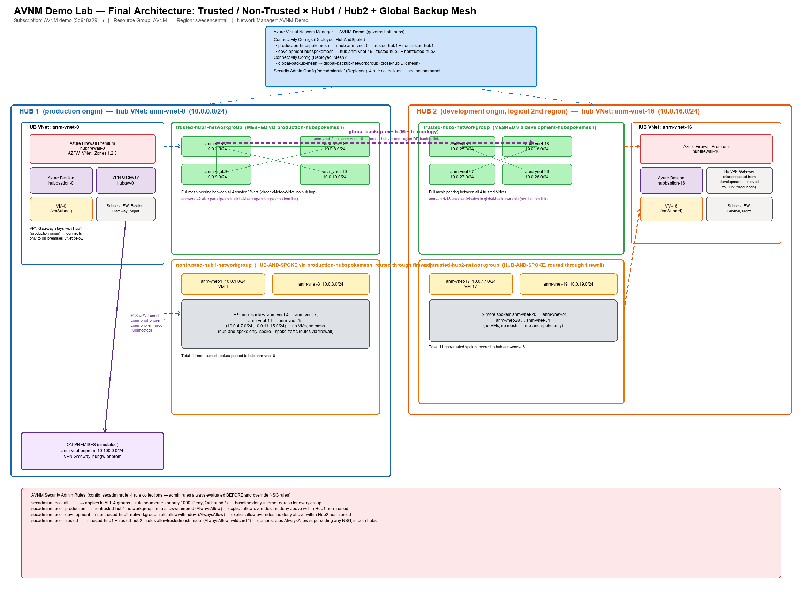
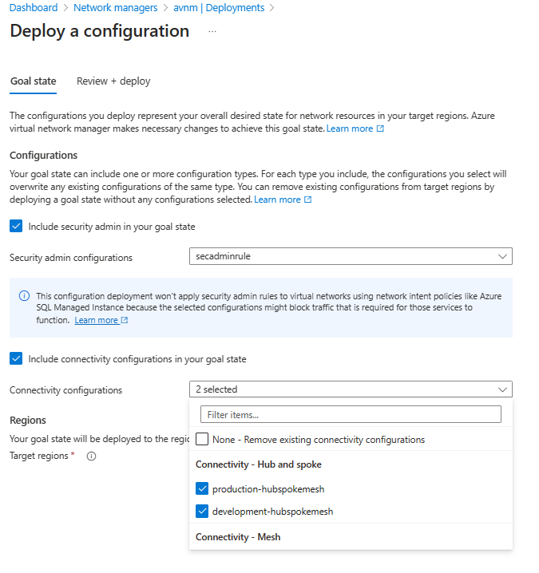
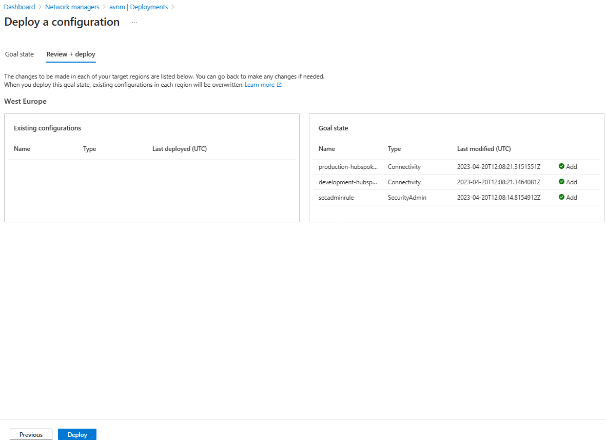
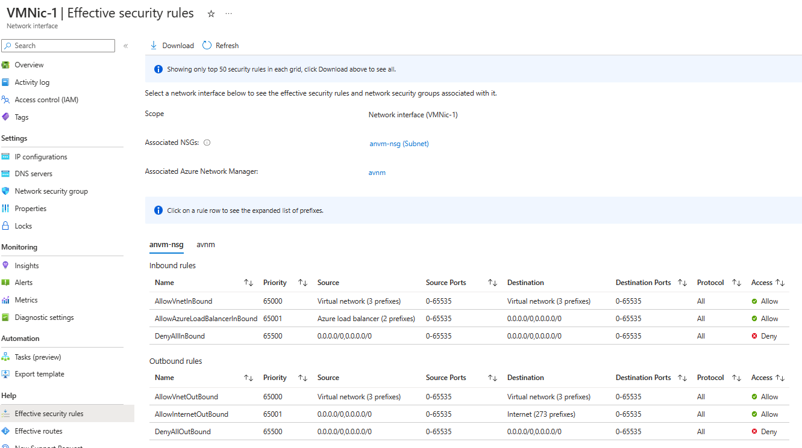
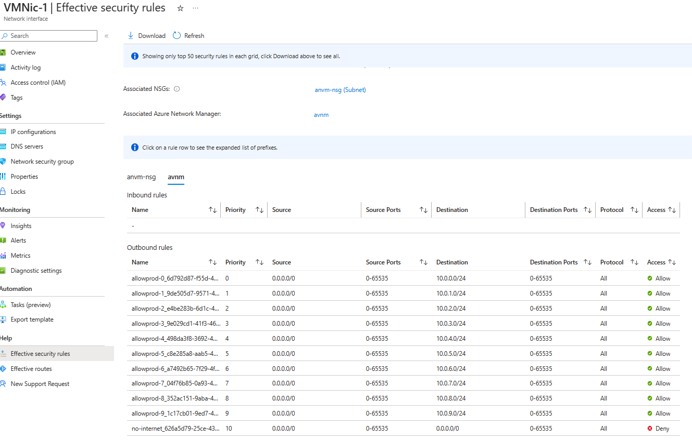
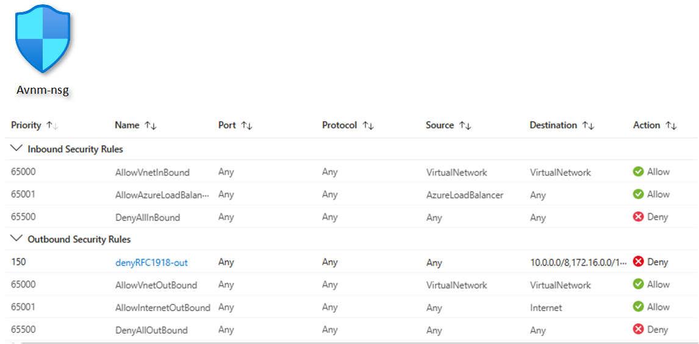
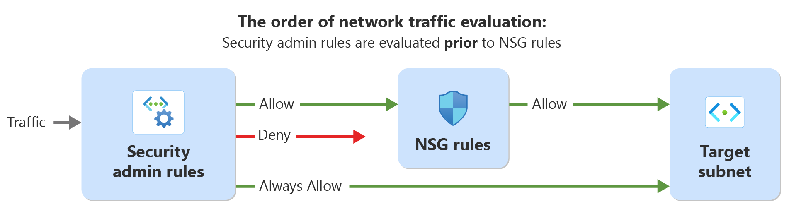

# Azure Virtual Network Manager (AVNM) Demo Lab

A hands-on Azure Virtual Network Manager environment for demonstrating centrally managed
connectivity and security across a multi-hub, multi-zone network estate — **without manual VNet
peering**. Deploy the base infrastructure with one Bicep template, then apply the AVNM
configuration described below to reproduce the exact live demo topology used in this repo.

> Sanitize before you share: this README uses `<your-subscription-id>` as a placeholder and never
> includes real passwords or public IPs. Replace with your own values.

## Architecture



The lab simulates **two hubs** (`Hub1` and `Hub2` — logically two regions/environments, both
deployed in `swedencentral` for capacity reasons, kept separate purely by naming and network-group
membership). Each hub is split into a **Trusted** zone (fully meshed) and a **Non-trusted** zone
(hub-and-spoke only, routed through that hub's own Azure Firewall). A **global backup mesh**
directly connects the two Trusted zones across hubs for disaster-recovery, and a simulated
on-premises network reaches only Hub1 over site-to-site VPN.

### The 5 network groups

| Network group | Members | Connectivity | Notes |
|---|---|---|---|
| `trusted-hub1-networkgroup` | `anm-vnet-2, 8, 9, 10` | **Mesh** (`production-hubspokemesh`, `useHubGateway=true`, hub `anm-vnet-0`) | Full any-to-any peering between all 4 VNets |
| `nontrusted-hub1-networkgroup` | `anm-vnet-1, 3–7, 11–15` (11 VNets) | **Hub & Spoke** (same config, hub `anm-vnet-0`) | Spoke↔spoke traffic routed through `hubfirewall-0`, no mesh |
| `trusted-hub2-networkgroup` | `anm-vnet-18, 25, 26, 27` | **Mesh** (`development-hubspokemesh`, hub `anm-vnet-16`) | Mirrors Hub1's trusted group in the second hub |
| `nontrusted-hub2-networkgroup` | `anm-vnet-17, 19–24, 28–31` (11 VNets) | **Hub & Spoke** (hub `anm-vnet-16`) | Routed through `hubfirewall-16`, no mesh — mirrors Hub1's non-trusted group |
| `global-backup-networkgroup` | `anm-vnet-2` + `anm-vnet-18` (one Trusted VNet per hub) | **Mesh** (`global-backup-mesh`, global scope, no hub) | Cross-hub / cross-region DR link between the two Trusted zones |

Each hub has **its own Azure Firewall** (`hubfirewall-0` in Hub1, `hubfirewall-16` in Hub2) acting
as the router for its Non-trusted spokes' transitive traffic — the modern
routing-configuration/firewall-as-router replacement for a VPN shortcut between environments.

**Simulated on-premises**: `anm-vnet-onprem` (`10.100.0.0/24`) with VPN gateway `hubgw-onprem`,
connected via site-to-site VPN (BGP) **only to Hub1** (`hubgw-0`). Hub2 has no VPN gateway — this
is deliberate segmentation: only the group that needs hybrid connectivity gets it.

### Security Admin rules (`secadminrule` configuration, 4 collections)

| Rule collection | Rule | Effect | Scope |
|---|---|---|---|
| `secadminrulecollall` | `no-internet` | **Deny**, outbound, priority 1000 | All 4 hub network groups (deny-all baseline) |
| `secadminrulecoll-production` | `allowwithinprod` | Allow, priority 300 | `nontrusted-hub1-networkgroup` |
| `secadminrulecoll-development` | `allowwithindev` | Allow, priority 320 | `nontrusted-hub2-networkgroup` |
| `secadminrulecoll-trusted` | `allowtrustedmesh-in` / `-out` (200/210) | **AlwaysAllow**, both directions | `trusted-hub1-networkgroup` **and** `trusted-hub2-networkgroup` |

`secadminrulecoll-trusted` is the key demo rule: **`AlwaysAllow` cannot be overridden by any NSG
downstream**, which is how a central platform team enforces non-negotiable policy while app teams
keep managing their own NSGs for everything else.

> **Key insight:** AVNM Mesh (`DirectlyConnected`) connectivity does **not** create classic VNet
> peering objects — it creates a **connected group**. Meshed VNets show nothing under the
> Peerings blade or `az network vnet peering list`; confirm mesh connectivity via effective routes,
> where it shows next-hop type **`ConnectedGroup`** (not "VNet peering").

## What gets deployed

| Resource | Count | Notes |
|---|---|---|
| Virtual Networks | 32 (`anm-vnet-0` … `anm-vnet-31`) | `/24` each, `10.0.{n}.0/24` |
| Virtual Machines | 6 (`VM-0/1/2` in Hub1, `VM-16/17/18` in Hub2) | One per hub, non-trusted spoke, and trusted spoke — enough to demo every scenario |
| Azure Firewall (Premium) | 2 | `hubfirewall-0` (Hub1), `hubfirewall-16` (Hub2) |
| Azure Bastion | 2 | `hubbastion-0`, `hubbastion-16` — RDP/SSH access without public IPs on the VMs |
| VPN Gateway | 2 | `hubgw-0` (Hub1 ↔ on-prem), `hubgw-onprem` (simulated on-premises) |
| Network Security Group | 1 (shared) | `anvm-nsg` — denies outbound RFC1918 traffic, priority 150 (demonstrates admin-rule override) |
| Network Manager | 1 | `AVNM-Demo` — 5 network groups, 3 connectivity configs, 1 security admin config |

### Quick-reference inventory (for the live demo)

| Role | Name | Private IP |
|---|---|---|
| VM — Hub1 | VM-0 | 10.0.0.4 |
| VM — Non-trusted Hub1 | VM-1 | 10.0.1.4 |
| VM — Trusted Hub1 | VM-2 | 10.0.2.4 |
| VM — Hub2 | VM-16 | 10.0.16.4 |
| VM — Non-trusted Hub2 | VM-17 | 10.0.17.4 |
| VM — Trusted Hub2 | VM-18 | 10.0.18.4 |
| Firewall Hub1 | hubfirewall-0 | 10.0.0.68 |
| Firewall Hub2 | hubfirewall-16 | 10.0.16.68 |
| Bastion Hub1 | hubbastion-0 | — |
| Bastion Hub2 | hubbastion-16 | — |
| VPN GW (Hub1) | hubgw-0 | — |
| VPN GW (on-prem sim) | hubgw-onprem | — |

**VM sign-in:** username is the value you supplied for `adminUsername` (defaults to `AzureAdmin`)
and password is the value you supplied for `adminPassword` at deployment time — connect via
**Bastion**, never RDP/SSH directly to a public IP.

## Deploy

### 1. Base infrastructure (Bicep)

```powershell
az login
az account set --subscription <your-subscription-id>

az deployment group create `
  -g <your-resource-group> `
  --template-file templates/main-hub-s2s.bicep `
  --parameters adminPassword='<a-strong-password>' sourceIPaddressRDP='<your-public-ip>/32'
```

This deploys the 32 VNets/VMs, both hubs' firewalls/bastions/gateways, the shared NSG, and an
initial 2-group AVNM baseline (Network Manager, one network group per hub, Hub & Spoke
connectivity, baseline security admin rules, a routing configuration for firewall-as-router).

### 2. Apply the Trusted / Non-trusted 4-group + global backup mesh topology

Starting from the base 2-group baseline, the live demo topology in this repo was reached with the
following AVNM changes (via `az network manager` CLI / Azure portal):

1. **Split each hub's network group into Trusted + Non-trusted** — create
   `trusted-hub1-networkgroup`, `nontrusted-hub1-networkgroup`, `trusted-hub2-networkgroup`,
   `nontrusted-hub2-networkgroup` and move each VNet's static membership into the correct group
   (Trusted = one hub VNet + 3 spokes per hub; Non-trusted = the remaining 11 spokes per hub).
2. **Retarget the connectivity configs** — `production-hubspokemesh` → both Hub1 groups,
   `development-hubspokemesh` → both Hub2 groups (`--applies-to-groups`, `useHubGateway=true`).
3. **Add the global backup mesh** — create `global-backup-networkgroup` containing one Trusted
   VNet per hub (`anm-vnet-2`, `anm-vnet-18`), then a new **Mesh** connectivity config
   `global-backup-mesh` (no hub, global scope) applied to that group.
4. **Retarget Security Admin rule collections** — `secadminrulecollall` → all 4 hub groups;
   `secadminrulecoll-production`/`-development` → the two Non-trusted groups;
   `secadminrulecoll-trusted` (`AlwaysAllow`) → both Trusted groups.
5. **Add the simulated on-premises VPN** — new `anm-vnet-onprem` VNet + `GatewaySubnet`, a
   `hubgw-onprem` VPN gateway, and `conn-*` site-to-site connections to `hubgw-0` only (remove any
   Hub1↔Hub2 gateway link — cross-environment reachability is now via mesh + firewall routing).
6. **Commit and deploy** both configuration types to the target region:
   ```powershell
   az network manager post-commit -g <your-resource-group> --network-manager-name AVNM-Demo `
     --commit-type Connectivity --target-locations swedencentral `
     --configuration-ids <production-hubspokemesh-id> <development-hubspokemesh-id> <global-backup-mesh-id>

   az network manager post-commit -g <your-resource-group> --network-manager-name AVNM-Demo `
     --commit-type SecurityAdmin --target-locations swedencentral `
     --configuration-ids <secadminrule-config-id>
   ```

   > **CLI gotchas learned the hard way:** `security-admin-config rule-collection update
   > --applies-to-groups` only keeps the *last* value if you pass multiple `network-group-id=X`
   > pairs in one flag — repeat the whole `--applies-to-groups` flag once per group instead.
   > `connect-config delete` takes `--configuration-name`, not `--name`. Deleting a network group
   > requires `az network manager group delete` (not `network-group delete`), and only works after
   > any config version that still references it has been redeployed.

7. **Verify** with `az network manager list-deploy-status` — all three connectivity configs and
   the security admin config should show `Deployed`, not just `Configured`.

Full change history is in [`whats-new.md`](whats-new.md).

## Explore the AVNM configuration (portal)



Portal → **Network Manager `AVNM-Demo`** → **Configurations** → select the Connectivity or
Security Admin configuration → **Deploy** → pick target region(s).











## Demo scenarios

The full rehearsal script with exact CLI commands and talking points is in
[`DEMO-SCRIPT.md`](DEMO-SCRIPT.md) (or the standalone [`DEMO-SCRIPT.html`](DEMO-SCRIPT.html)).
Highlights:

1. **Topology overview** — one Network Manager, 5 groups, 3 connectivity configs, 1 security admin
   config, governing 32 VNets across two simulated regions.
2. **Trusted Mesh vs. Non-trusted Hub-and-Spoke** — compare effective routes on `VMNic-2`
   (`ConnectedGroup`, direct mesh) vs. `VMNic-1` (hub-only, `VirtualAppliance` next hop).
3. **Firewall as router** — transitive spoke↔spoke routing through `hubfirewall-0`/`-16`, no VPN
   or manual UDRs required.
4. **Security Admin rules supersede NSGs** — `curl` from a Trusted VM succeeds despite the shared
   NSG's deny rule, because `AlwaysAllow` wins; the same test from a Non-trusted VM fails as
   expected.
5. **Dual-hub symmetry** — Hub1 and Hub2 are configured identically, showing the model scales to
   multi-region without per-region policy duplication.
6. **Global backup mesh / DR** — every Trusted VNet can reach its cross-hub counterpart directly,
   independent of the primary hub-and-spoke topology.
7. **Scoped on-premises VPN** — `hubgw-onprem` reaches Hub1 only; Hub2 has no path to on-prem at
   all, demonstrating deliberate network segmentation.
8. **Live connectivity test matrix** — a table of VM-to-VM `curl`/`Test-NetConnection` checks run
   from Bastion, with expected pass/fail results for each topology rule.

## Repository layout

```
templates/
  main-hub-s2s.bicep    # Base infrastructure: VNets, VMs, firewalls, bastions, gateways, NSG,
                         # and an initial 2-group AVNM baseline
  main-hub-s2s.json     # ARM (JSON) build of the same template
images/                 # Architecture diagram + portal screenshots referenced above
DEMO-SCRIPT.md           # Full rehearsal script: inventory, security rules, 8 scenarios
DEMO-SCRIPT.html         # Same script, standalone HTML for presenting without a markdown viewer
whats-new.md             # Change log of every AVNM configuration change applied to reach this topology
```

## Cleanup

```powershell
az group delete -g <your-resource-group> --yes --no-wait
```

## Prerequisites

- An Azure subscription with quota for ~32 VNets, 6 VMs (`Standard_D2s_v5`), 2 Azure Firewall
  Premium instances, 2 Azure Bastion instances, and 2 VPN gateways in your chosen region.
- Azure CLI, logged in (`az login`) with Network Contributor (or higher) on the target
  subscription/resource group.
- A public IP (or CIDR) to allow for Bastion/management access — replace the sample
  `sourceIPaddressRDP` default with your own.

## Credits

Base infrastructure template adapted from the original [`mddazure/avnm-demo`](https://github.com/mddazure/avnm-demo)
lab; the network group topology, global backup mesh, on-premises VPN, and demo scenarios in this
repo are a custom redesign built on top of it.
